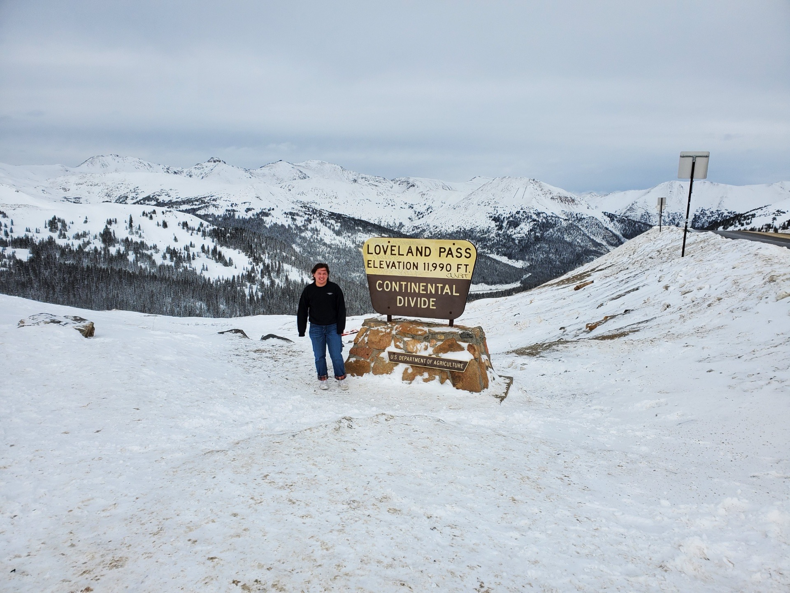

Englewood to Breckenridge
======
####Description:
This route will take you from Englewood, a small town where I grew up located South of Denver, to a tourist town in the Rocky Mountains.

####About the Stops:
*The first stop* on this route is in Idaho Springs. Home to the Colorado Mountain Pie, Beau Jo's pizza is a must-eat. The Mountain pie has hand-rolled edges which must be dipped in honey when eating.

Avoiding the traffic found at the Eisenhower Tunnel on I-70, we will be taking Loveland Pass to our next stop.

*The second stop* is the Great Continental Divide. Located at an elevation of 11,990 feet above sea level, this marker represents the separation of watersheds. One side of the divide feeds into the Pacific Ocean and the other into the Atlantic Ocean.

*The third stop* on this route, curtesy of taking Loveland Pass, is an overlook of the Dillon Reservoir and Rocky Mountains in the background. Pull over and enjoy the scenery!

*Our third stop* on this route is the Mountain Top Cookie Shop. Serving over 40 different kinds of cookies, this shop has something for everyone.

*The final stop* on our route is at a trailhead which will lead you on a short path to a smaller, new attraction in Breckenridge. Isak Heartstone is the name of the friendly 15-foot tall wooden troll sculpture located on the Trollstigen Trail. This troll was placed here in 2019 and was built by Danish artist Thomas Dambo.

While in Breckenridge, check out the lively Main Street with colorfully painted buildings from the 1880s and 90s housing shops, galleries, and restaurants. Depending on the season, go skiing or snowboarding at the world-class resort. Summer time offers great hikes and green scenery. Breckenridge has something to offer for everyone.

The basemap for this map was found [here](https://leaflet-extras.github.io/leaflet-providers/preview/).
The route for this map was created on [google maps](https://www.google.com/maps/).
All pictures above are my own.
